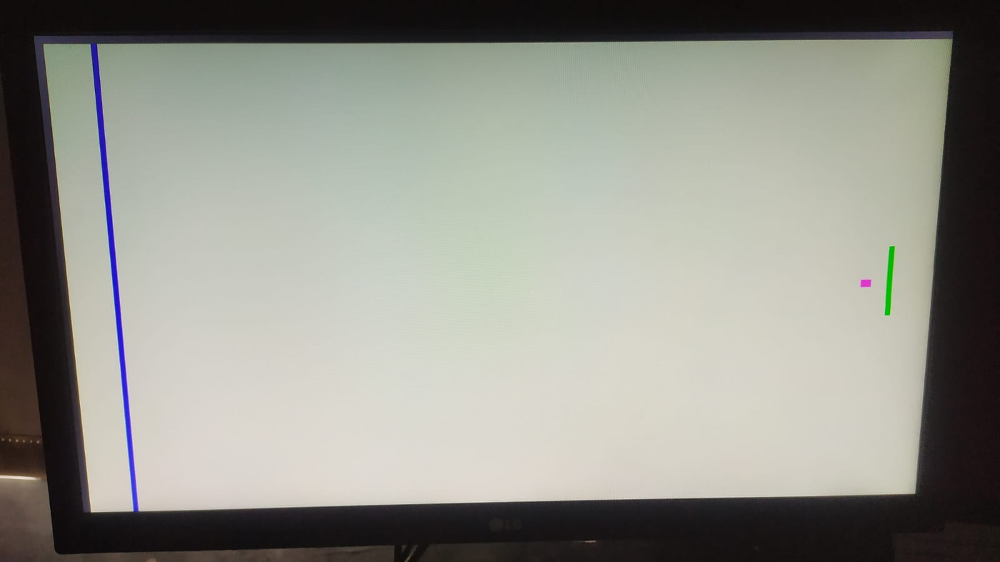
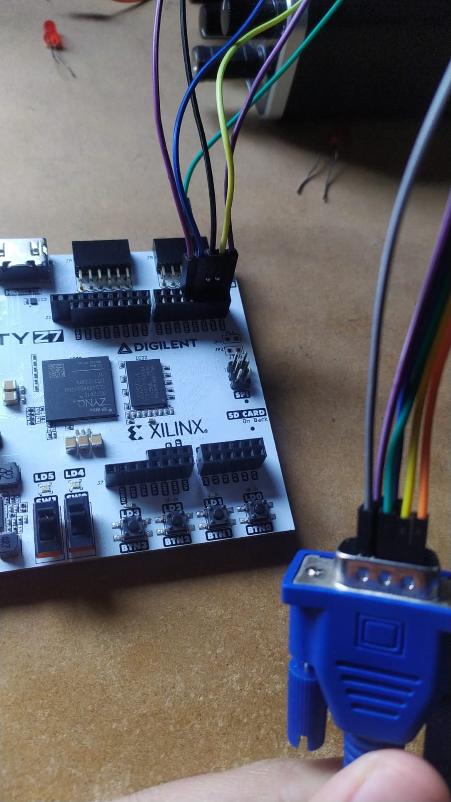

# TP_CLP CONTROLADOR VGA
El trabajo consta del diseño de un controlador para VGA utilizando la placa ARTY Z10 de XILINX en lenguaje VHDL.
La aplicación del controlador es presentar una pantalla estática de Ping Pong. 

## Conexiones VGA con FPGA

